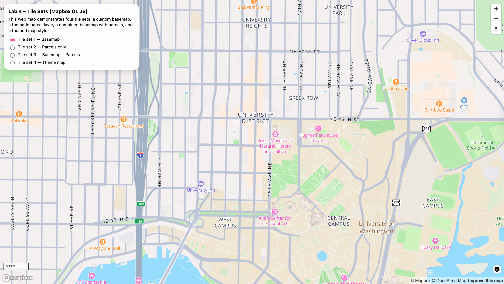
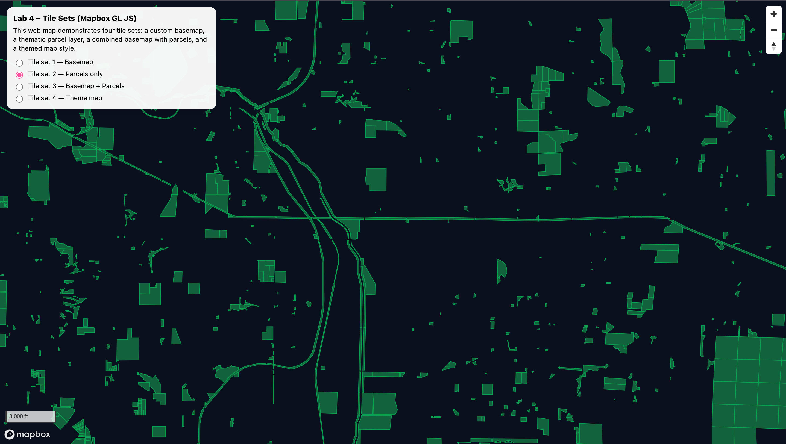
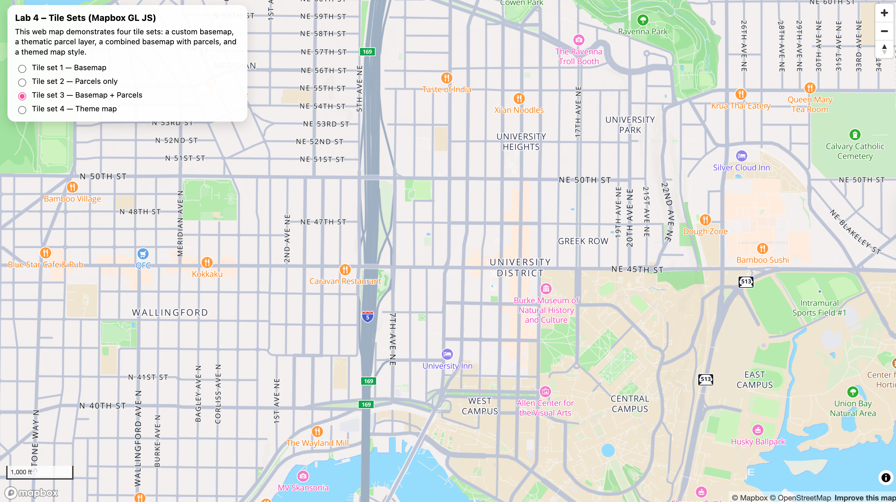
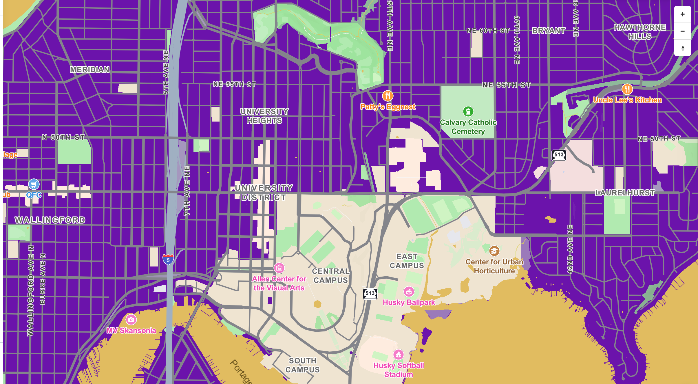

# Lab 4 – Map Design and Tiles Generation

This project demonstrates the creation and visualization of four tile sets using **Mapbox GL JS** and **Mapbox Studio**, focusing on parcel data in Seattle, Washington.

---

## 🌐 Web Map URL
https://mrcllvnh.github.io/geog458-lab4/

---

## 🗺️ Examined Geographic Area
The examined geographic area is **University District, Seattle, Washington (King County)**.  
The thematic dataset focuses on **public parcel polygons** within the city and surrounding areas.

---

## 🧱 Tile Sets Overview

### Tile set 1 — Basemap
A customized basemap created in Mapbox Studio using Mapbox Standard as the base.  
The map uses a muted color palette and modified labels to provide geographic context without overpowering thematic layers.

**Zoom levels:** z0 – z22  

---

### Tile set 2 — Parcels only
A thematic tile set created from a custom vector tileset containing public parcel polygons.  
The parcels are displayed on a dark background to emphasize parcel geometry without additional context layers.

**Zoom levels:** z11 – z16  

---

### Tile set 3 — Basemap + Parcels
This tile set combines the customized basemap (Tile set 1) with the parcel thematic layer (Tile set 2).  
The basemap provides spatial context while the parcel polygons highlight land parcel distribution.

**Zoom levels:**  
- Basemap: z0 – z22  
- Parcels: z11 – z16  

---

### Tile set 4 — Theme map
A themed map designed entirely in Mapbox Studio.  
This map uses a bold purple color scheme and visual contrast to emphasize parcels while maintaining legible labels and landmarks.

**Zoom levels:** z0 – z22  

---

## 🛠️ Technologies Used
- Mapbox Studio
- Mapbox GL JS
- GitHub Pages
